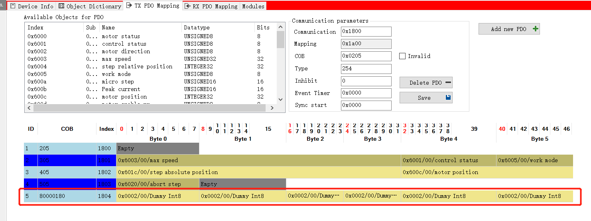

# ESP32-SKIDS-NANO-CANOPEN

工程拷贝自nathanRamaNoodles/CANopen-ESP32-nodes.git
工程目的：
在ESP32上作为主站控制基于CANOPEN的电机驱动。

## 相关文件介绍

* CO_config.h 配置CAN的端口、缓存、周期、超时等参数;
* CO_driver_target.h 定义了一些基本的参数，大小端、数据结构、宏定义等，在CO_driver.h中被包含;
* CO_driver.h CANOPENNODE不同平台的接口头文件，分别定义了函数CO_CANsetConfigurationMode、CO_CANsetNormalMode、CO_CANmodule_init、CO_CANmodule_disable、CO_CANrxMsg_readIdent、CO_CANrxBufferInit、CO_CANtxBufferInit、CO_CANsend、CO_CANclearPendingSyncPDOs、CO_CANverifyErrors;
* CO_driver.c 接口文件的实现，文件中用到的一些宏定义在ESP-IDF编译环境中提供;
* modul_config.h 外设定义，如电机的站地址、CAN接口波特率等的定义;
* CO_OD.c CO_OD.h 外设的字典文件，由工具[CANopenEditor](https://github.com/CANopenNode/CANopenEditor)自动生成;

## CANOPEN启动过程

* mainTask函数中直接调用CO_init尝试初始化，入口参数会传递当前设备ID、当前设备波特率
* CO_init函数位于CANOpen.c中，先调用CO_new完成对CANopen协议栈对象CO的创建和初始化，CO在CANOpen.c中定为为空指针，对象实体为COO,同样在CANOpen.c中被定义。
* 然后，CO_init函数调用CO_CANinit，进一步调用CO_CANmodule_init，此函数中完成对结构体CANmodulePointer，timingConfig，filterConfig，generalConfig的初始化配置。然后函数逐层返回。
* 返回CO_init后继续执行，调用CO_CANopenInit完成CANOPENnODE协议栈的初始化，根据配置依次调用CO_SDO_init，CO_EM_init，CO_NMT_init，CO_CANtxBufferInit，CO_LSSmaster_init，CO_SYNC_init，CO_TIME_init，CO_RPDO_init，CO_TPDO_init，CO_HBconsumer_init，CO_SDOclient_init，CO_trace_init。这里的配置主要在CO_OD.h中完成，此文件由CANopenEditor工具自动生成。
* 返回mainTask函数后继续执行，创建定时器，定时器会调用coMainTask函数，此函数中依次调用CO_process_SYNC，CO_process_RPDO，CO_process_TPDO函数，SYNC先判断是否在同步时间窗内，如果在完成RPDO和TPDO数据的同步。
* mainTask函数继续执行，调用CO_CANsetNormalMode，进一步调用can_driver_install、can_start、定义定时调用CO_CANinterrupt函数(函数执行can接口的数据缓存)。至此完成了协议栈和平台CAN端口的启动工作。
* CO_sendNMTcommand发送NMT命令，启动电机
* dunker_init完成电机初始化。
* 完成初始化后程序进入while循环，循环中100ms为周期调用CO_process函数处理，完成对NMT、EM、SDO、HBconsumer报文的处理。
* 进入死循环后还有2个定时器任务在执行分别是1s执行一次的coMainTask和CO_CANinterrupt。
* CO_CANinterrupt中接收到的报文会通过buffer->pFunct上的回调函数CO_XX_receive对报文信息进行处理。这些回调函数是在初始化时调用CO_CANrxBufferInit函数时注册的，CO_XX_init函数中都会调用这个注册函数。这些回调函数会完成对收到报文的解析，并调用SET_CANrxNew发送数据到达消息。最终大SDO、EM、NMT、HB消息会在CO_process函数中通过子函数调用被处理，处理后会调用CLEAR_CANrxNew清理新消息标志。
* 其中CO_TPDO_process和其中CO_RPDO_process会由coMainTask中的CO_process_TPDO/CO_process_RPDO函数调用，也会由CO_CANinterrupt的回调函数调用。


## CO_OD
```
  #define CO_NO_SYNC                     1   //Associated objects: 1005-1007
  #define CO_NO_EMERGENCY                1   //Associated objects: 1014, 1015
  #define CO_NO_TIME                     0   //Associated objects: 1012, 1013
  #define CO_NO_SDO_SERVER               2   //Associated objects: 1200-127F
  #define CO_NO_SDO_CLIENT               1   //Associated objects: 1280-12FF
  #define CO_NO_LSS_SERVER               0   //LSS Slave
  #define CO_NO_LSS_CLIENT               0   //LSS Master
  #define CO_NO_RPDO                     4   //Associated objects: 14xx, 16xx
  #define CO_NO_TPDO                     4   //Associated objects: 18xx, 1Axx
  #define CO_NO_NMT_MASTER               1   //0x1F80 = 1
  #define CO_NO_TRACE                    0
```

## PDO配置流程
1. 无效PDO
2. 清除原有配置；子索引0写0
3. 写入PDO映射内容；分别写入映射参数子索引
4. 写入PDO映射对象总数，总数写入子索引0
5. 有效PDO，PDO的COB-ID最高位写1

## PDO传送方式
PDO传输类型在通信参数子索引0x02上。主要有同步传输方式，与CAN总线的SYNC信号有关，接收到X个SYNC后发送；异步传输方式，由事件触发，包括数据改变触发，周期性定时器触发。
* 当TPDO的传输类型为0时，如果数据发生改变，并且收到一个同步帧，则发送该TPDO；
* 当TPDO的传输类型为1-240时，接收到相应个数的同步帧时，发送该TPDO;
* 当TPDO的传输类型为254或255时，映射数据发生改变或事件计时器到达时发送该TPDO；
* 当RPDO的传输类型为0-240时，只要收到一个同步帧则将该RPDO最新的数据更新到应用；
* 当RPDO的传输类型为254或255时，将接收到的数据直接更新到应用。

## 如何控制一个电机


## 如何同时控制两个电机

## CO_new返回错误
PDO配置可能回导致CO_new函数返回错误，相关代码如下：
```
CO_ReturnError_t CO_new(void)
{
    int16_t i;
#ifndef CO_USE_GLOBALS
    uint16_t errCnt;
#endif

    /* Verify parameters from CO_OD */
    if(   sizeof(OD_TPDOCommunicationParameter_t) != sizeof(CO_TPDOCommPar_t)
       || sizeof(OD_TPDOMappingParameter_t) != sizeof(CO_TPDOMapPar_t)
       || sizeof(OD_RPDOCommunicationParameter_t) != sizeof(CO_RPDOCommPar_t)
       || sizeof(OD_RPDOMappingParameter_t) != sizeof(CO_RPDOMapPar_t))
    {
        return CO_ERROR_PARAMETERS;
    }

...
}
```
这里因为OD_TPDOMappingParameter_t或OD_RPDOMappingParameter_t不是如下类型：
```
typedef struct {
               UNSIGNED8      numberOfMappedObjects;
               UNSIGNED32     mappedObject1;
               UNSIGNED32     mappedObject2;
               UNSIGNED32     mappedObject3;
               UNSIGNED32     mappedObject4;
               UNSIGNED32     mappedObject5;
               UNSIGNED32     mappedObject6;
               UNSIGNED32     mappedObject7;
               UNSIGNED32     mappedObject8;
               }              OD_TPDOMappingParameter_t;
```
配置PDO时肯能得到的mappedObject数量小于8，从而导致返回CO_ERROR_PARAMETERS错误。解决办法是在PDO中增加1个无效的选型，各字段配置为dummy。如下图：


## 注意事项
* 0x1400-0x1403 0x1600-x01603 0x1800-0x1803 0x1a00-0x1a03 这几个字典命名需字段内完全一致，否则会出错
* 0x1400-0x1403 0x1600-x01603 0x1800-0x1803 0x1a00-0x1a03 字典内各字段需要与CO_PDO.h中定义的字段完全一致，因为CO_new函数中会做字段匹配
* 0x1600, 0x1a00字段不需要编辑，在做PDO Mapping的时候会自动填充
* 编辑字典文件时，PDO中出现的各寄存器，RPDO映射的寄存器必须为SDO可访写的，否则会出现通信错误。
